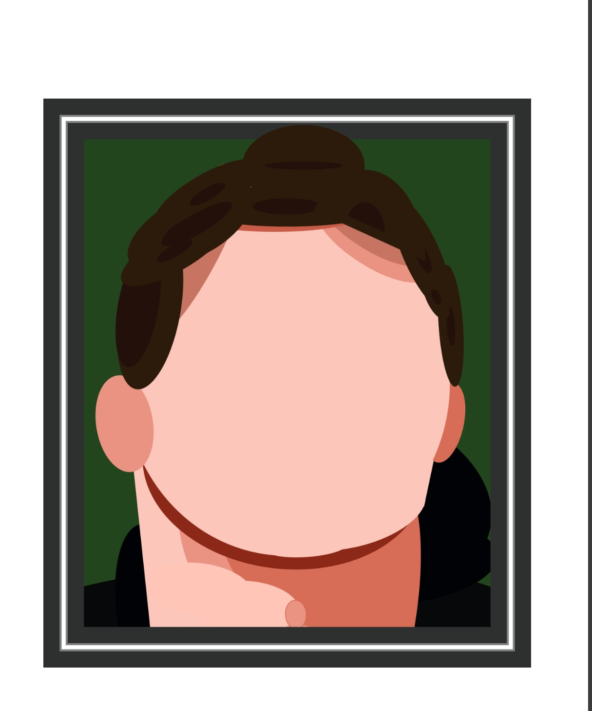
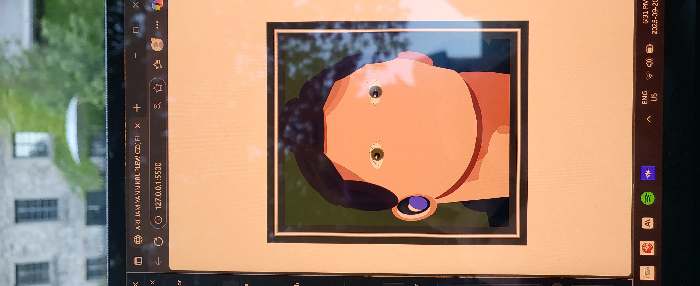
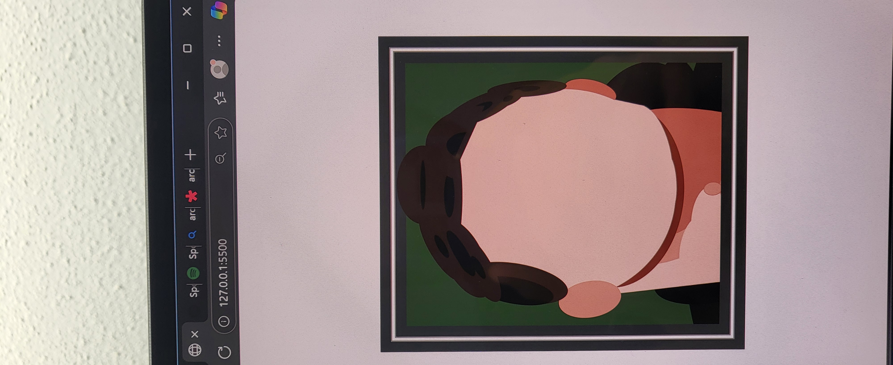
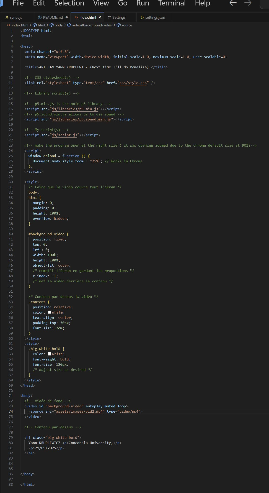
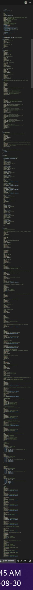

# ART JAM YANN K

YANN KRUPLEWICZ

[View this project online](URL_FOR_THE_RUNNING_PROJECT)

## Description

This autoportrait represents me in a picture my mother took with her camera, i have tried to represent it as realistic as possible, hence the use of shadows. Altough the cartoon style gives it a sense of uniqueness.

The background and the music whose main theme is nostalgia make the artwork a deep reflection about time passing by since the character seems to get older as time passes by due to the hair color and the wrinkles.
It took me around 2000 lines of codes (including HTML) to realize this autoportrait.
Today, September 29, it is officially finished.

## Screenshot(s)

>  on sept 20
>  on sept 20

As we can see in the pictures, the functions are organised and there is a mask function. In this program i have used a function 'FrameMask' to block my portait into a frame, but if we look closely we  can see that the hair are out of the frame, which was my intention because the character looks like a cartoon and lots of gags in cartoons are based on breaking rules like that. I have also used different functions that i haven't used before to help me be more accurate regarding the details, hence the function called 'DetailsNeck' in my program. Shapes have been added one after the other for each element. Shapes that i have used are mainly rectangles, ellipses and arcs. I have also made them rotate a lot to find the right angles.

> 

This is the original photo i have used to make this autoportrait.

The eyes especially were the hardest part to make because of the smallest details that had to be accurate while only using arcs and ellipses.

> , picture taken on Sept 19th
> , picture taken on Sept 20

As the week passes by, all elements have been added one after the other. Today the program includes ears, hair, eyes, neck and so on.
Variables create change over time, the hair, originally black finally turns white. similarly, the background shifts from white to black so that the hair is still visible.
Similarly, an interactive conditional happens when the user clicks on the frame, wrippes appear. Well, they were there since the beggining it's actuallt only their color that change.
This was calculated using mouse x and y to allow some user interaction. Moreover, when the user clicks anywhere on the screen, a song begins using conditionals again.

I have also had to modify more complex things such as the display size on google chrome to make it appear the way I wanted.

For the change in hair color I got inspired by the program in the video 6 of the conditionals series where the pet dies and becomes grey or is bored and black as well as the program in the 'variable' video series where the variable ufo.color becomes ufo.color + 1.
I have made this change very slow though, at a speed of 0.08.
Similarly I used the UFO program from the "variables" video series to help me make the variables the right way.
The ideas of adding a background and a music came later. 

I added the music in the script.js file while the video is located in the index.html file.

> , picture taken on Sept 30
here is the index HTML file at the end, used for video background and general styling
> , picture taken on Sept 30
here is the script.js file at the end, we can see the lenght of it that is very long

## Attribution

> - This project uses [p5.js](https://p5js.org).
> - The clown image is a capture of the clown from the Apple emoji character set.

> - This project uses [song10.mp3](https://www.youtube.com/watch?v=fBE_2sHDt4E).
> - Song from the band Twenty one pilots.
> - This project uses [vid2.mp4](https://pixabay.com/fr/videos/temps-date-limite-horloge-%C3%A9toiles-37954/).
>-  animated video from ChristianBodhi

## License

> This project is licensed under a Creative Commons Attribution ([CC BY 4.0](https://creativecommons.org/licenses/by/4.0/deed.en)) license with the exception of libraries and other components with their own licenses.