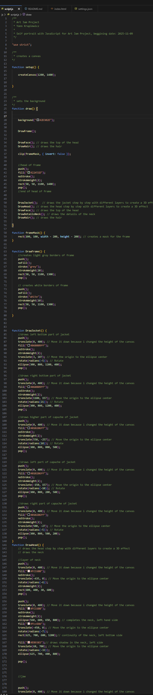
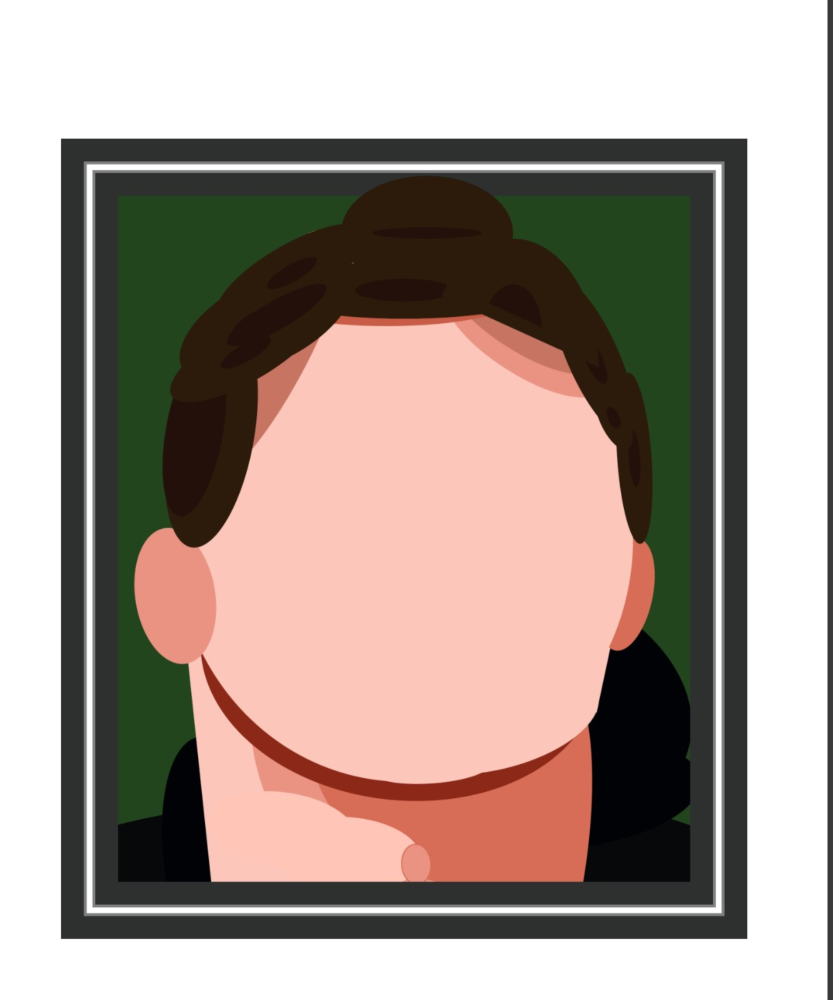

# ART JAM YANN K

YANN KRUPLEWICZ

[View this project online](URL_FOR_THE_RUNNING_PROJECT)

## Description

This autoportrait represents me in a picture my mother took with her camera, i have tried to represent it as realistic as possible, hence the use of shadows. Altough the cartoon style gives it a sense of uniqueness

## Screenshot(s)

This bit should have some images of the program running so that the reader has a sense of what it looks like. For example:

> 
> 

As we can see in the pictures, the functions are organised and there is a mask function. In this program i have used a function 'FrameMask' to block my portait into a frame, but if we look closely we  can see that the hair are out of the frame, which was my intention because the character looks like a cartoon and lots of gags in cartoons are based on breaking rules like that. I have also used different functions that i haven't used before to help me be more accurate regarding the details, hence the function called 'DetailsNeck' in my program.

> 

## Attribution

This bit should attribute any code, assets or other elements used taken from other sources. For example:

> - This project uses [p5.js](https://p5js.org).
> - The clown image is a capture of the clown from the Apple emoji character set.
> - The barking sound effect is "single dog bark 1" by crazymonke9 from freesound.org: https://freesound.org/people/crazymonke9/sounds/418107/

## License

This bit should include the license you want to apply to your work. For example:

> This project is licensed under a Creative Commons Attribution ([CC BY 4.0](https://creativecommons.org/licenses/by/4.0/deed.en)) license with the exception of libraries and other components with their own licenses.