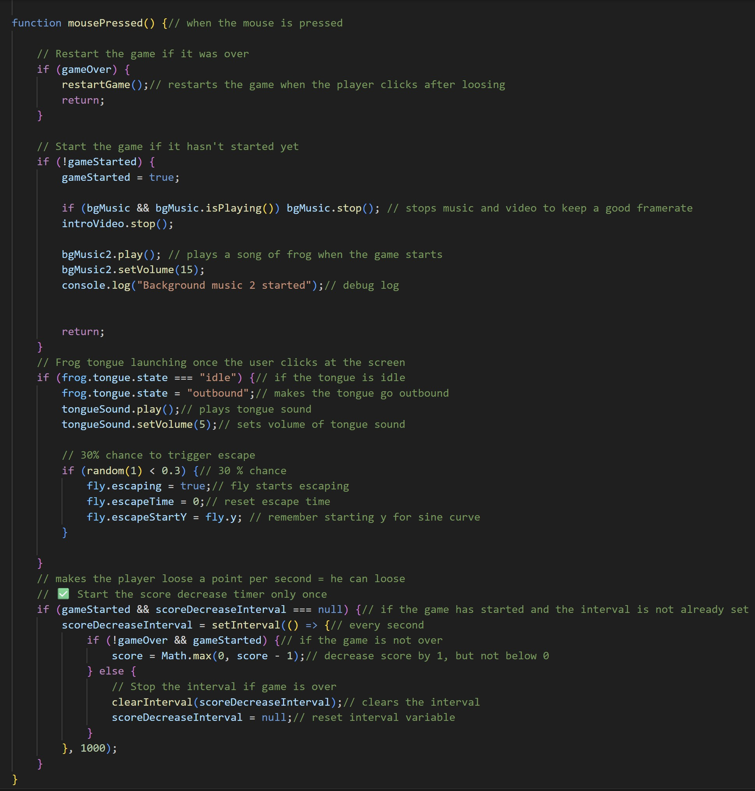

# The 21st Century Frog Game

A game about catching flies.

[Play it!](https://yannkruplewicz-afk.github.io/cart253/MOD%20JAM/)

- [Ideas](./ideas.md)
- [Planning](./planning.md)
- [Pseudocode](./pseudocode.md)

## Description

This video game is about a frog, controlled by the player, catching flies, the frog.x position being liked to the x position of the mouse. This is the basic principle that was given at the beggining. Then i elaborated on it.

In my game, there is an instructions screen with a retro style. In it, we can see a teenajer in his room listening to music, playing a game in his computer while oustide is the storm, the player can identify with this character, that's the goal. The game begins once the mouse is clicked, by a frog sound, the backrgound sound is a basic nature sound. Whenever the player begins to move, he can't stop, otherwise he looses because the score decreases by one each second. If the player looses, an end screen with a frog sound, the same sound, appears. Clouds are in the sky, moving at different speed to give a real nature ambience. Flies are worth different points, from 5 for the smallest ones to 2 for the biggest ones.
Regarding flies, they can avoid the frog's attacks 30% of the time. if the player reaches a score of 10 or more, a streak also begins. The sky turns orange, it is the twilight, water drops fall from the sky and damage the player by retiring 2 points to the score. Additionally, the clouds become faster as well as the flies and the background sound changes. The frog sound and the vibrating screen announce the streak. The aim of the streak is to put the player in a 'flow' mode, by being captivated by the pace of the game. That's why the flies' speed grows gradually. Once the player looses, his best score is saved at the top of the screen.

By the way the game is called "the 21st century frog game" because the frog is wearing glasses otherwise she doesn't see the flies, probably because she played too much video games when she was younger, in the 20th century. It is also from the 21st century because the teenajer and his computer in the instructions screen are from the 21st century.

## Screenshot(s)

>  on oct 29

Here is a picture displaying all the variables i have used in my program, to do all sorts of things, from music playing to streaks to fly escaping, with a comment for each, describing their exact function.

>  on oct 28

This part represents the MOUSEPRESSED function which plays a central role in my program. Thanks to it, the flies can escape, the game can start, or restart, the frog can use its tongue, musics can play and the score can change. This is all due to "if" conditionnals.

> , on oct 29

This part represents in details how i have made to make the flies be able to move independently, and at unexpected moments. We can see here that the variables shown is "coding advancement part1" are being used to make this effect happen. The combination of "if" conditionnals and variables make them retreat sommetimes, with a curved trajectory and go forward again, 1.3 times faster. Sommetimes, the same fly can unexpectedly avoid the frog's attacks three times in a row !

> , picture taken on october 29th
This picture shows the instructions screen with the font i added from google font as well as the background video that i believe, fits pretty much well with the game itself, giving it a retro like effect.

> , picture taken on october 29th
Picture showing what the game looks like. A frog with glasses in link to the title, flies, a blue sky and clouds.

> , picture taken on october 29th
Here we can see what the game looks like during the streak, we have a twilight like sky with bubbles falling from it, damaging the frog if touched, these bubbles have a splash effect if touched. Everything is faster here.

> , picture taken on october 29th
This shows the end screen, there was a twilight during the streak, now there is a sunset, with the same retro font.

## Attribution

> - This project uses [p5.js](https://p5js.org).

> - The font used comes from google Font, it is called "PressStart2P" : https://fonts.googleapis.com/css2?family=Press+Start+2P&display=swap

> - This project uses [music1.mp3] as the instructions screen's song (Pixabay).

> - This project uses [song2.mp3] as the frog's sound at the beggining and end of the game (Pixabay).

> - This project uses [Begstreaksound.mp3] as the frog's sound during streaks (Pixabay).

> - This project uses [song3.mp3] as the frog's tongue sound (by default in the program).

> - This project uses [sound3.mp3] as the flies'sound (Pixabay).

> - This project uses [sound4.mp3] as the nature sound during basic gameplay (Pixabay).
> - This project uses [StreakSound.mp3] as the nature sound during streaks (Pixabay).

> - This project uses [intro.mp4] as the instructions screen background video (https://pixabay.com/fr/videos/pi%C3%A8ce-temp%C3%AAte-chien-cat-lit-164386/).
>-  animated video from u_zys3fy54t3
> - This project uses [video2.mp4] as the end of game screen background video (https://pixabay.com/fr/videos/%C3%A9clipse-le-coucher-du-soleil-pixels-184857/).
>-  animated video from u_3ufeinwaqh

## License

> This project is licensed under a Creative Commons Attribution ([CC BY 4.0](https://creativecommons.org/licenses/by/4.0/deed.en)) license with the exception of libraries and other components with their own licenses.