# QUE ? The variation run game.

A game, three sub games showing different places and talking about different things.

[Play it!](https://yannkruplewicz-afk.github.io/cart253/Variation%20JAM/)

## Description

This video game was inspired by Subway Surfer. My first idea was : " a character running, a music playing, when he hits an obstacle the music's volume decreases, when the song is over, the player wins". I have made 3 different games based on that. In three different places. Quebec, USA and Spain. The name QUE ? refers to What is that ? There is no real intention there, i have just a spanish friend who often say " QUUUEEEEE", i just got inspired. Depending on the sub game, the atmosphere changes. Quebec : the forest, bears, people biking, trees, maple trees, maple sirup, It can be sometimes a little "chliche", that's the point. Each region has musics associated with it. For each level, the tempo of the music leads the game. As the obstacles arrive faster, the music, depending on level 1, 2 or 3, has a faster tempo, to help the player be in a state of flow. Finally, after 300 seconds, the 3 songs have been played ( 100 seconds per song ), the screen fades, the obstacles disappear, the player wins. We can see contrasts and different ways of living through the games. Small cars for Spain, big Chevrolets for USA, biking for Quebec. The player has 3 lives, if he hits an obstacle, he loses 1 and the song's volume decreases for 2 seconds. 3 lives lost and the player loses. 

## Screenshot(s)

> 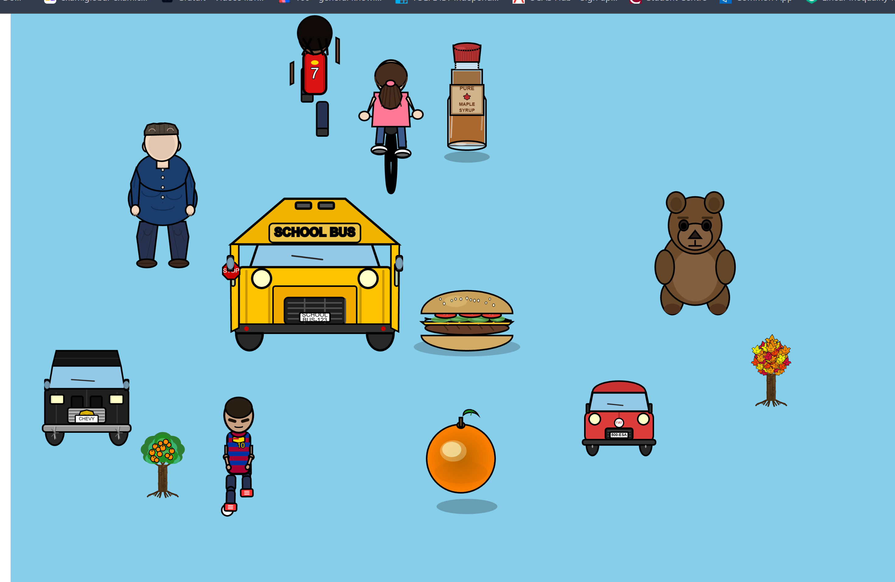 on nov 28

I have made a separate folder called "Variation Jam tests" in which i have been designing the charcters for my game. 4 for each region, + a school bus intended to be for USA but was taking too much space on the screen so i removed it.

> 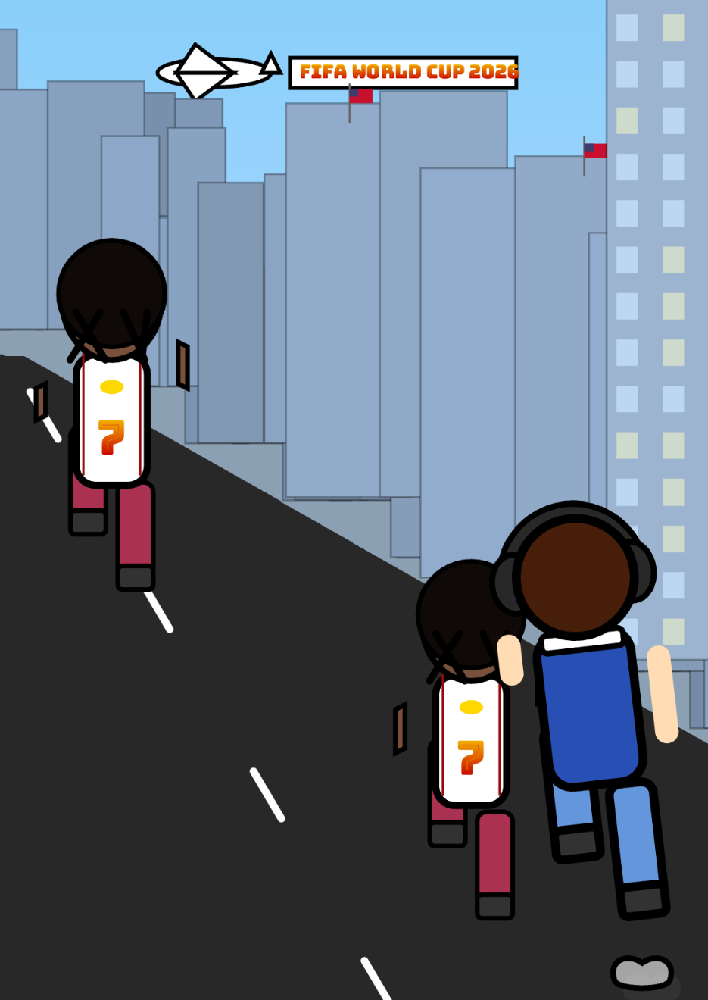 on dec 1

References to the WORLD CUP of soccer of 2026 added in the background of USA. We can see banners on buildings and held by planes passing by every 20 seconds

> 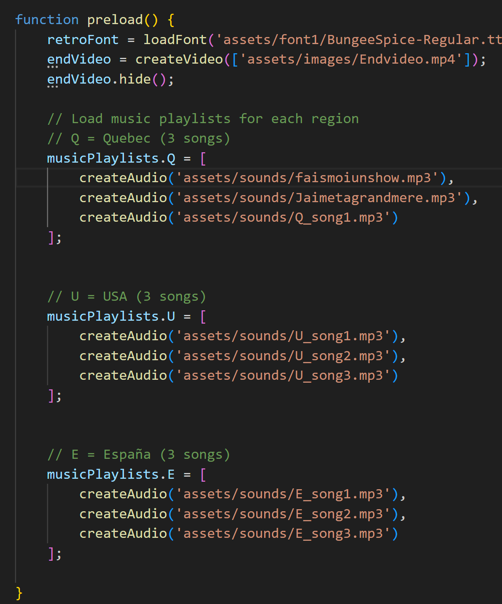, on nov 15
> 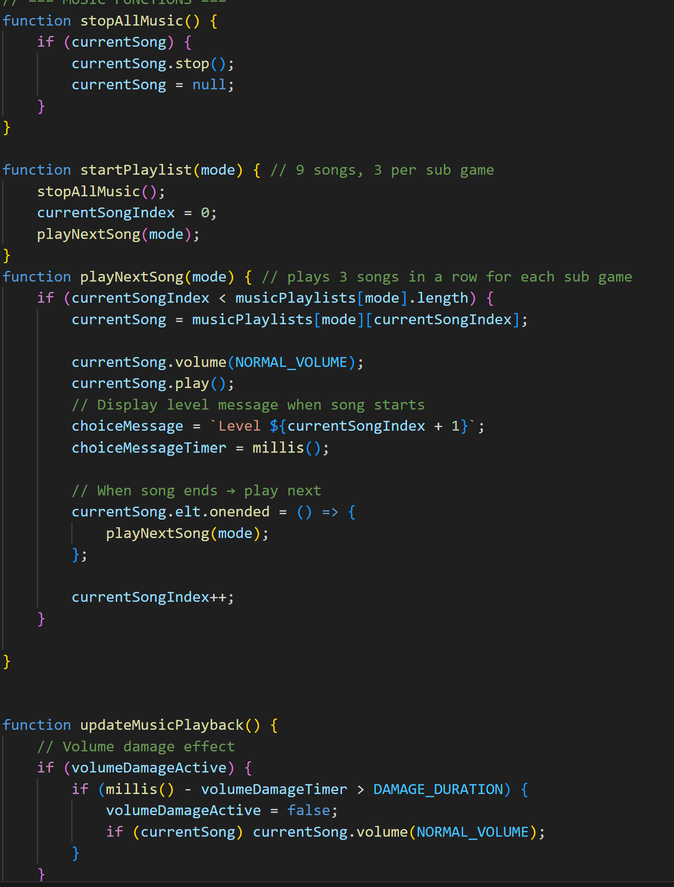, on nov 15

This part represents the playlist / music playing structure. It shows how the music are encoded to follow each other depending on the levels.

> 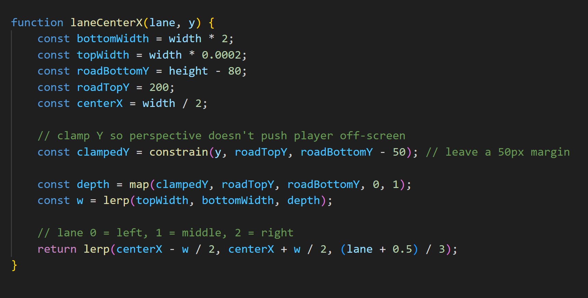, on november 17
Invisible lines guide the spawning obstacles to the player, the player moves on those same lines, here's the code. These lines have the same colors as the different roads.

> 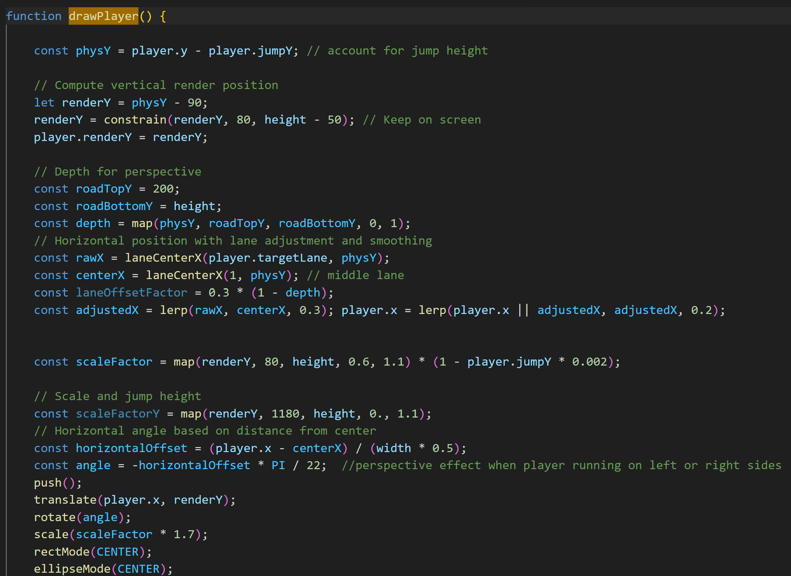, on nov 27
> 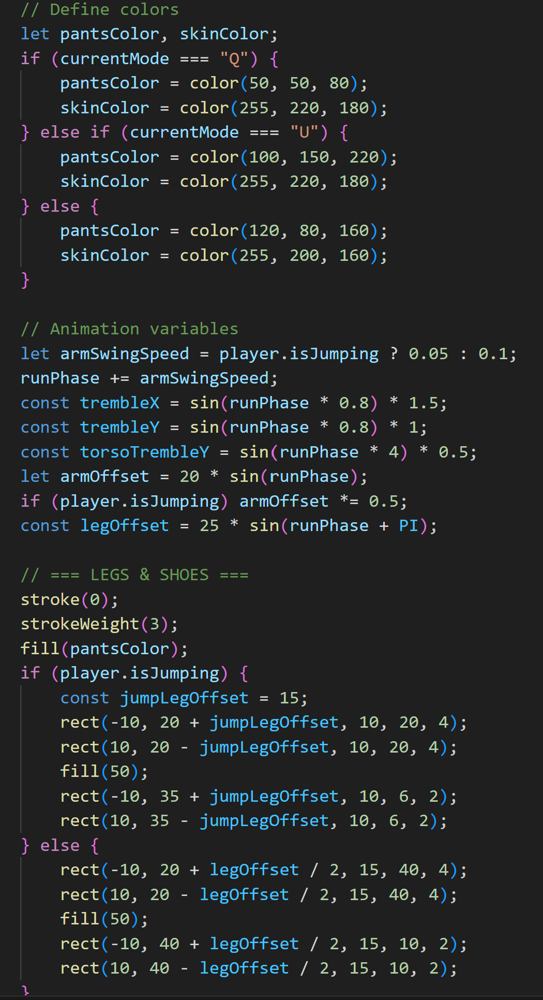, on nov 27
> 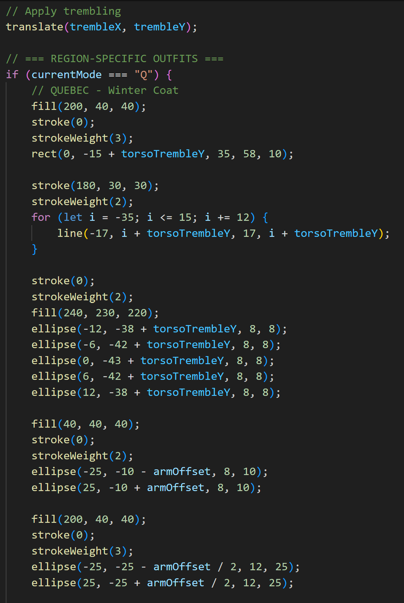, on nov 27
> 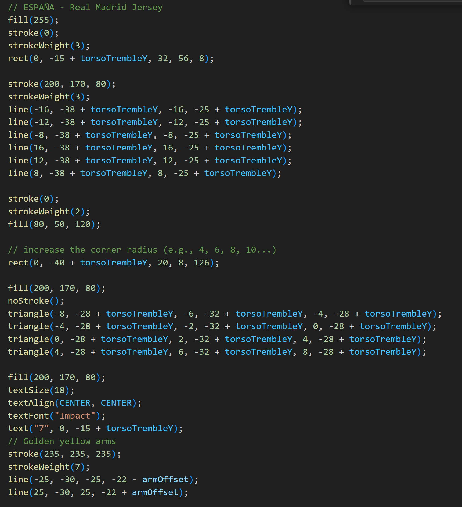, on nov 27
This picture shows the player's design, depending on the sub game / region chosen. He is wearing a headset, from which the music is coming, that's we hear it, because we are the player. The perspective of the whole player changes if he goes right / left. When he jumps, his right leg bends forward. He is wearing a coat for Quebec because it is cold. A real madrid jersey for Spain with the inconic number 7. He also shakes a bit for more realism.

> , on november 28
The iconic number 7 of CR7 " SUUUIIIIIIIII" is also present in the USA version with famous streamer Ishowspeed racing the player, but loosing because the player is faster.

> 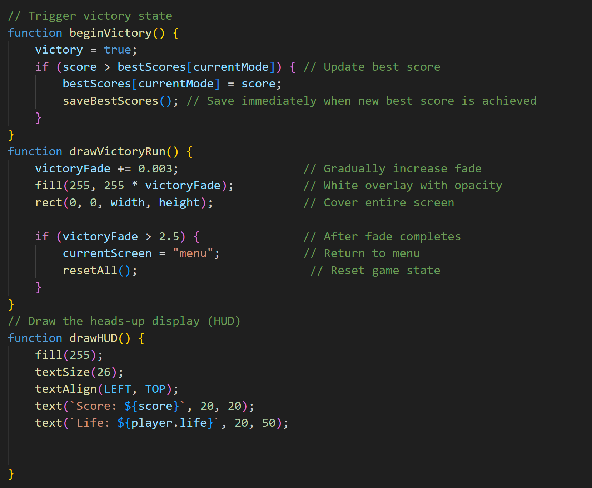, on november 30
This picture shows the end of game when the screen fades and that the player is redirected to the main menu, made using the 'victory fade' and the 'currentScreen' variables.

> 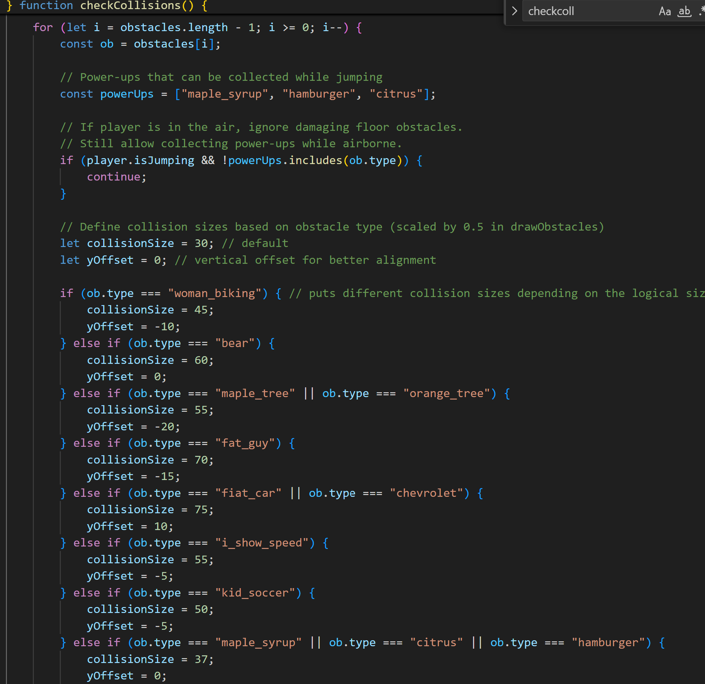, on december 2
The check collision function is adapted for each elements, with realistic values depending on their respective sizes.

> , on december 2
The USA and Spain backgrounds originally had windows in every buildings, but the game was lagging, so i had to remove them. I kept them only in the first buildings in the foreground, which, i think, is a good compromise.

## Attribution

> - This project uses [p5.js](https://p5js.org).

> - The font used comes from google Font, it is called "Bungee+Spice" : https://fonts.google.com/specimen/Bungee+Spice

> - This project uses musics such as 

Les colories (quebec song1) by Alex Nevsky
Jaime ta grand mere(quebec song2) by Les Trois Accords
Fais moi un show de boucane(quebec song3) Les soeurs Boulay

Let me down slowly(USA song1) by Alec Benjamin
SEE you again(USA song2) by Wiz Khalifa and Charlie Puth
Big Poppa(USA song3) by The Notorious B.I.G

La primavera(Spain song1) by Manu Chao
Hasta el almanecer (Spain song2) by Nicky Jam
Ana Mena, Rocco Hunt - A Un Paso De La Luna(Spain song3) by Reik, Rocco Hunt, Ana Mena 
 

> - This project uses [endvideo.mp3] by olenchic as (https://pixabay.com/fr/videos/%c3%a9couteur-microphone-%c3%a9galiseur-156605/), found on pixabay.

## License

> This project is licensed under a Creative Commons Attribution ([CC BY 4.0](https://creativecommons.org/licenses/by/4.0/deed.en)) license with the exception of libraries and other components with their own licenses.